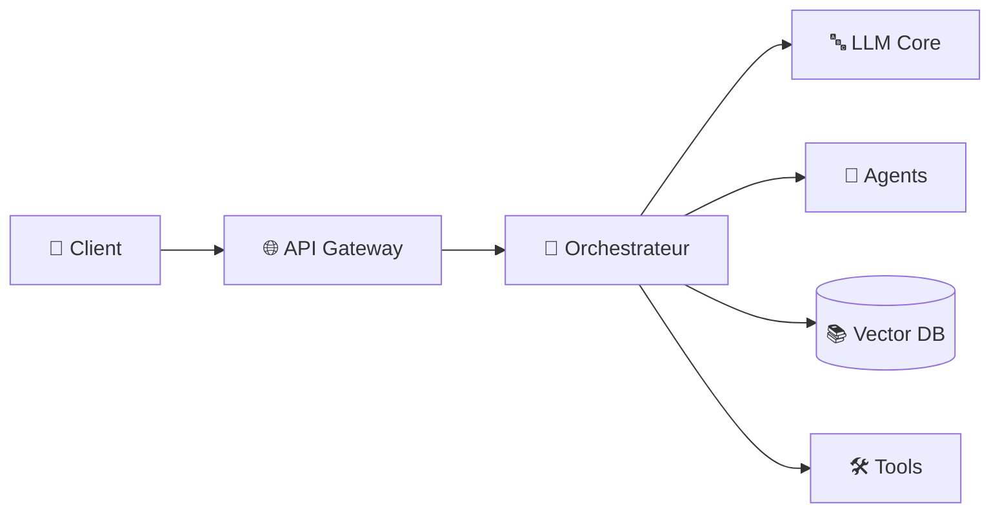

# 🧬 OpenEvolveHybrid – Architecture IA hybride open-source évolutive et modulaire

> Framework expérimental pour concevoir, tester et faire évoluer des architectures d'intelligence artificielle hybrides (LLM + Outils + Services) de manière structurée et incrémentale.

## 🎯 Objectif

Le projet **OpenEvolveHybrid** est un laboratoire d'architecture conçu pour explorer et valider des configurations complexes de systèmes IA. Il permet de passer d'un prototype monolithique à une architecture distribuée, modulaire et hautement scalable.

### Points clés :
- **Modularité totale** : Découplage des modèles de langage (LLM), des bases de connaissances (RAG) et des outils d'exécution.
- **Évolutivité incrémentale** : Passage fluide entre différentes configurations d'architectures (profiles) sans réécriture du code.
- **Hybridation** : Capacité à combiner des services cloud (OpenAI, Anthropic) avec des solutions locales (Ollama) et des outils métiers spécifiques.

---

## 🏗️ Architecture du framework

Le système repose sur quatre piliers fondamentaux :
1. **LLM Core** : Orchestration des modèles de langage via des abstractions unifiées.
2. **Modules de Raisonnement** : Agents spécialisés, planners et gestionnaires de contexte.
3. **Data Layer** : Intégration de bases de données vectorielles (RAG) et relationnelles.
4. **Execution Hub** : Passerelle API et monitoring de performance.



---

## 📂 Structure du projet

```text
OpenEvolveHybrid/
├── Config/             # Profils d'architecture (YAML)
├── Code/
│   ├── core/           # Abstractions et interfaces
│   ├── orchestrators/  # Planners et managers
│   ├── rag/            # Logique d'indexation et recherche
│   └── api/            # Serveur FastAPI / gRPC
├── Diagrams/           # Schémas d'architecture (Mermaid)
└── Docs/               # ADR (Architecture Decision Records)
```

---

## ⚙️ Stack technique

- **Langage** : Python 3.10+
- **Orchestration** : LangChain / LangGraph (ou framework maison extensible)
- **API** : FastAPI
- **Vector DB** : ChromaDB / Qdrant
- **Configuration** : YAML pour la gestion des profils dynamiques

---

## 📦 Installation

```bash
# Cloner le dépôt
git clone https://github.com/dagornc/OpenEvolveHybrid.git
cd OpenEvolveHybrid

# Configurer l'environnement
python -m venv .venv
source .venv/bin/activate
pip install -r requirements.txt
```

---

## ▶️ Utilisation rapide

```python
from open_evolve_hybrid.core import Engine

# Charger un profil d'architecture spécifique
engine = Engine.from_profile(\"hybrid_agent_v1\")

# Exécuter une requête à travers l'architecture choisie
response = engine.query(\"Conçois une solution de monitoring pour un cluster Kubernetes.\")
print(response.content)
```

---

## 🗺️ Roadmap

- [ ] Génération automatique de diagrammes d'architecture à partir des fichiers YAML.
- [ ] Benchmarking comparatif entre différents profils (Qualité vs Latence vs Coût).
- [ ] Support natif de l'optimisation des prompts via DSPy.
- [ ] Interface de visualisation temps réel des flots d'exécution des agents.

---

## 📄 Licence

Ce projet est sous licence **MIT**.
